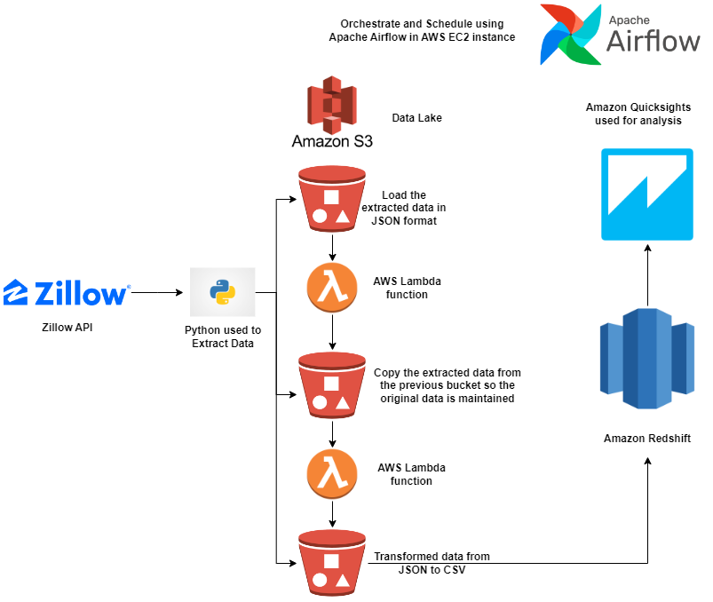
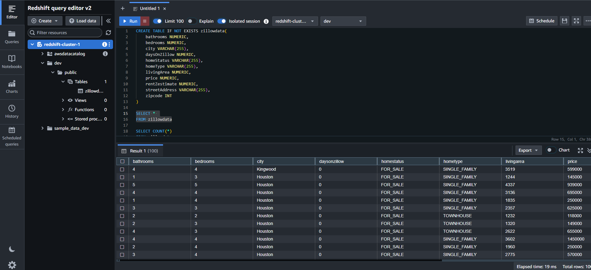
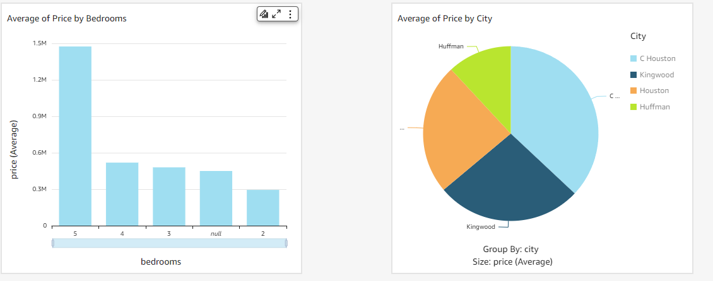
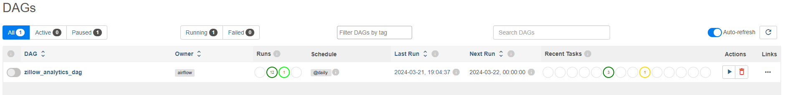
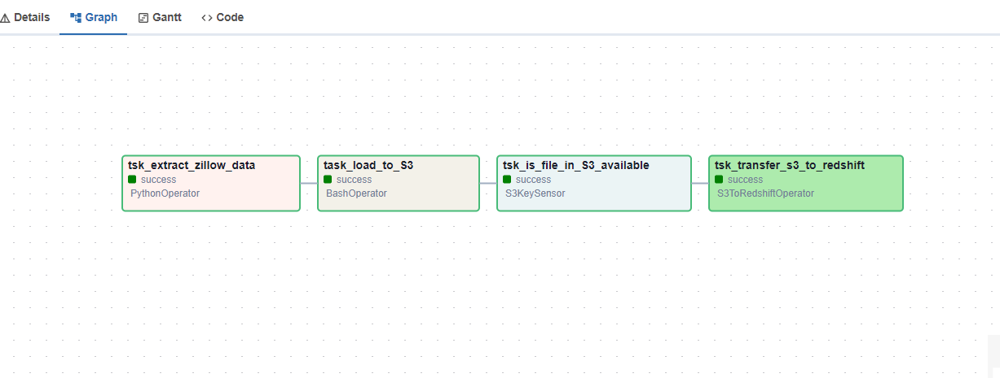

# Zillow Data Pipeline

This repository contains the code for an end-to-end data pipeline that extracts data from Zillow, transforms it, and performs analytics using Amazon Redshift and Amazon QuickSight.

## Architecture



The architecture diagram above illustrates the flow of data in the pipeline. Here's a high-level overview of the pipeline steps:

1. Data Extraction: Python scripts are used to extract data from Zillow in JSON format.

2. Data Transfer to S3: The extracted data is transferred to an Amazon S3 bucket for storage and further processing.

3. Lambda Function: A Lambda function is triggered to transfer the data from the original S3 bucket to another S3 bucket. This ensures that the original data remains intact.

4. JSON to CSV Conversion: Another Lambda function is used to convert the JSON data to CSV format.

5. Data Transfer to Amazon Redshift: The CSV data is then transferred to an Amazon Redshift cluster for storage and analysis.

6. Analytics with Amazon QuickSight: Amazon QuickSight is used for data visualization and analytics on the data stored in Amazon Redshift.

## Environment Setup

### Hardware Used

- t2.medium EC2 instance on AWS

```
t2.medium
2 vCPUs, 4 GiB memory

```
### Setting up Airflow

Once the Aamzon EC2 instance is all set and running then you can connect the airflow with Ubuntu terminal and then follow the below steps to set up the airflow.

```python
# Install the required packages
sudo apt-get update
sudo apt-get install python3-pip
sudo apt-get install python3-venv
python3 -m venv airflow_venv
source airflow_venv/bin/activate
sudo pip install pandas
sudo pip install apache-airflow

airflow standalone - To start the airflow
```

Once the airflow is running then copy the public IPv4 address and paste it in the browser with the port number 8080. You will see the airflow UI.

Finally, copy the dag folder under airflow home folder. Please also set up the Airflow connection for S3KeySensor and Amazon Redshift [here](). For more information, you can also check the official [documentation](https://airflow.apache.org/).

### Creation of S3 Bucket

Create an S3 bucket in the AWS Management Console to store the extracted data from Zillow. Make sure you have the necessary permissions to read and write data to the bucket.

1. Bucket Name: `zillow-etl`

2. Bucket Name: `zillow-copy-of-raw-json-bucket`

3. Bucket Name: `zillow-trasnform-from-json-to-csv`

### Setting up Lambda Functions

1. **Data Transfer Lambda Function**: This Lambda function is triggered when new data is uploaded to the original S3 bucket. It copies the data to another S3 bucket to ensure the original data remains intact.

Code to get the data transfer lambda function is [here]()

Make sure you trigger the Lambda function with the S3 bucket named **zillow-etl**. 

2. **JSON to CSV Conversion Lambda Function**: This Lambda function converts the JSON data to CSV format before transferring it to Amazon Redshift.

Code to get the JSON to CSV conversion lambda function is [here]()

Make sure you trigger the Lambda function with the S3 bucket named **zillow-copy-of-raw-json-bucket**.

Run the DAG at this point and check that the pipeline is working as expected. You should see the data being extracted from Zillow, transferred to S3, converted to CSV. If there are any errors make sure to check the logs in the Airflow UI.

### Setting up Amazon Redshift

Create an Amazon Redshift cluster in the AWS Management Console to store the transformed data from Zillow. Make sure you have the necessary permissions to create a cluster and access it.

Redshift: For Redshift I used ra3.xlplus node type with single node structures. Make sure you check the prices before you start using it.

Please add a connection for the Redshift in the Airflow UI. Refer to the image over [here]().

Write the SQL queries to create the tables in the Redshift cluster. Image for the SQL query is 

After that, please run the DAG and check the logs in the Airflow UI. You should see the data being transferred to Amazon Redshift and the data being added to the table.

Query the tables using the Amazon Redshift Query Editor to verify that the data has been successfully loaded. Code - 
```SELECT * FROM zillow_data;```

### Setting up Amazon QuickSight

Create an Amazon QuickSight account in the AWS Management Console to visualize and analyze the data stored in Amazon Redshift. Make sure you have the necessary permissions to create a QuickSight account and access it.

Once the quicksight account is created then you can select the Amazon Redshift automatic load data option in order to load the data and then you can start creating the visualizations according to your needs. 

Image of the visualization is 

## DAG Pipeline View



## DAG View




## Results

Output can be seen by calling the SQL query and image is 

## Credits

I took help from the following resources to build this project:

* [Apache Airflow Documentation](https://airflow.apache.org/)
* [AWS Documentation](https://docs.aws.amazon.com/)
* [Zillow API Documentation](https://www.zillow.com/howto/api/APIOverview.htm)
* [Amazon Redshift Documentation](https://docs.aws.amazon.com/redshift/index.html)
* [Amazon QuickSight Documentation](https://docs.aws.amazon.com/quicksight/index.html)

Last but not least I would like to thank [Opeyemi Olanipekun](https://www.linkedin.com/in/opeyemi-olanipekun-ph-d-pmp-certified-six-sigma-black-belt-02735133/) for the amazing video on youtube. 


